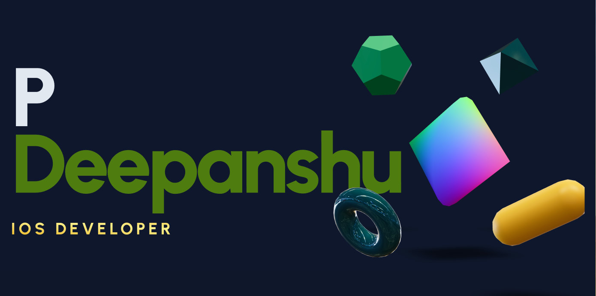

  

###

<h1 align="left">Hello, I'm P D, an iOS Engineer 👋🏻.</h1>

###

<h6 align="left">👨🏻‍💻 I do freelance work as an iOS Engineer. 🛜 currently working on the Rust Project 👨🏻‍🎓 studying/learning CTF</h6>

###

<h2 align="left">Tech Stack:</h2>

###

<h5 align="center">Languages</h5>

###

  
  
  
  
  
  
  
  
  
  
  
  
  
  
  

###

<h5 align="center">Framework / Hosting</h5>

###

  
  
  
  
  
  
  
  
  
  
  
  
  
  
  
  
  
  
  
  
  
  
  
  
  

###

<h5 align="center">Database</h5>

###

  
  
  
  
  
  
  
  
  

###

  
  

###

###
